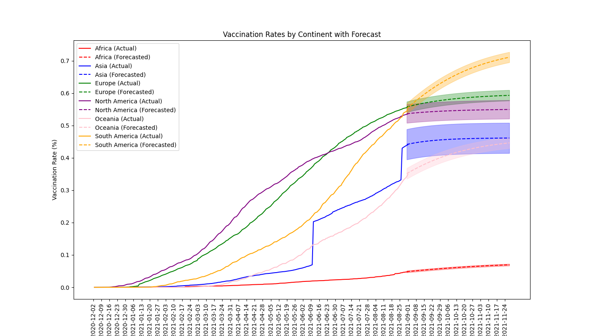

# Covid Evaluation Repository

This README provides an overview of the Covid Evaluation Repository. The repository contains various files dedicated to exploring, analyzing, preprocessing and forecasting COVID data.

## Repository Structure

- `data/` : This folder contains all the data utilized by this project.

- `data_exploration_analysis.ipynb` : This Jupyter notebook holds the code for data exploration and preprocessing.

- `streamli_app.py` : This python file contains code for the dashboard, presented via Streamlit.

- `forecasting.ipynb` : This file creates forecasting of vaccination rates by continent.

## Dashboard

COVID interactive dashboard can be found at [this link](https://covid-analytics-dashboard-d7e8ed5a011d.herokuapp.com/).

## Vaccination Forecasting

In the repository, we forecast the vaccination rates for different continents. The final results can be seen in the graph below:

## Data notes

Data is taken from [Our World in Data](https://ourworldindata.org/covid-vaccinations)
